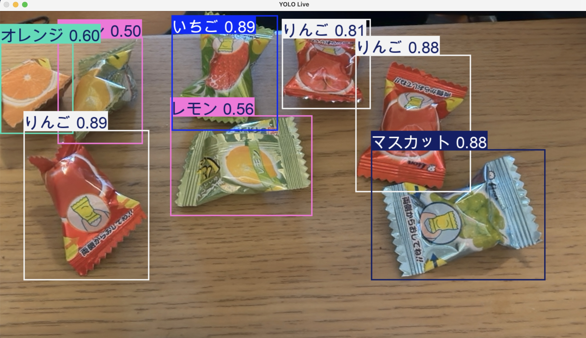

# YOLO キャンディ検出

YOLOを使ってリアルタイムでキャンディを検出するプロジェクト。



## 概要

- 学習画像数: 約160枚（少ないデータ数でのチャレンジ）
- モデル: YOLOv8
- トレーニング: epoch 60
- アノテーションツール: [Label Studio](https://labelstud.io/)（オープンソース）

## 環境構築

```bash
pip install ultralytics opencv-python
```

## 使い方

```bash
python live_detection.py
```

## モデル

学習済みモデルは `my_model/` に格納されています。
